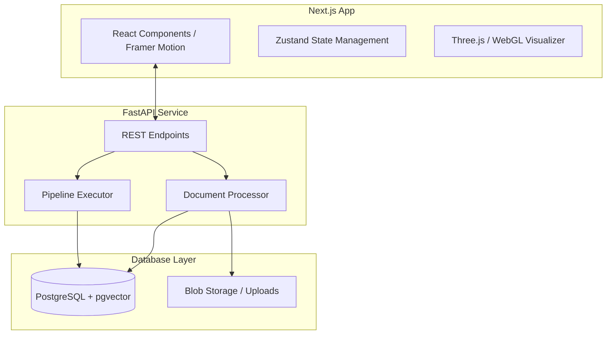

# ChunkScope 🔭

**The "Inspect Element" for RAG.**

ChunkScope is a high-density forensic toolkit designed for modern RAG (Retrieval-Augmented Generation) architectures. It provides developers with the visual and analytical tools needed to deep-dive into vector spaces, debug retrieval quality, and optimize knowledge graphs with surgical precision.


## 🚀 Key Features

### 1. 🔍 Analyzer
Perform forensic analysis on document chunking.
- **Token Overlap Maps**: Visualize how chunks overlap to ensure context continuity.
- **Semantic Density**: Identify areas of high and low information density.
- **Real-time Feedback**: Tweak chunking parameters and see results instantly.

### 2. 🌌 Visualizer
Explore your embeddings in 3D.
- **Cluster Discovery**: Identify semantic islands and gaps in your knowledge base.
- **Interactive Inspection**: Click on any embedding to see the underlying source text.
- **Coordinate-Locked Overlays**: Natural PDF navigation with precise chunk highlighting.

### 3. 🛠️ Pipeline Builder
Orchestrate and benchmark custom RAG pipelines.
- **Modular Nodes**: Drag-and-drop nodes for Embeddings, Retrieval, Reranking, and LLM processing.
- **Presets**: Industry-standard templates for quick deployment.
- **Performance Profiling**: Measure latency and retrieval accuracy (Recall@K, MRR).

## 🏗️ Architecture



## 🛠️ Tech Stack

- **Core**: FastAPI (Python), Next.js (TypeScript)
- **Database**: PostgreSQL with `pgvector`
- **Frontend Utility**: Tailwind CSS, Framer Motion, Lucide React
- **Visualization**: Three.js, WebGL (custom GLSL shaders)
- **ORMs**: SQLAlchemy, Alembic

## ⚙️ Getting Started

### 1. Prerequisites
- Python 3.10+
- Node.js 18+
- PostgreSQL with `pgvector` extension

### 2. Backend Setup
```bash
cd backend
python -m venv .venv
source .venv/bin/activate  # Windows: .venv\Scripts\activate
pip install -r requirements.txt
cp .env.example .env  # Configure your database & API keys
uvicorn app.main:app --reload
```

### 3. Frontend Setup
```bash
cd frontend
npm install
npm run dev
```

The application will be available at `http://localhost:3000`.

## 📜 License
MIT License - see [LICENSE](LICENSE) for details.

---
Built with 🧡 by the ChunkScope Team.
