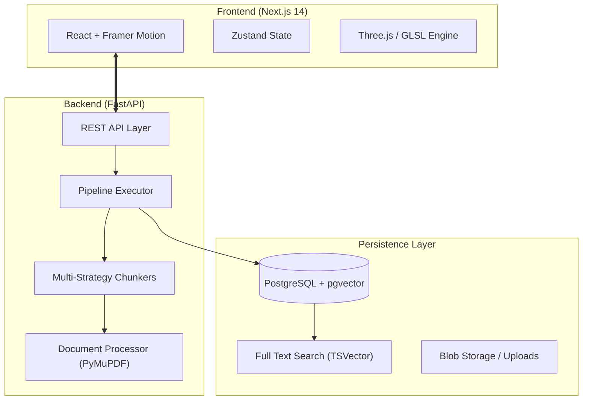

<div align="center">
  
  <h1>ChunkScope 🔭</h1>
  <p><b>The "Inspect Element" for RAG.</b></p>

  [](https://github.com/1Ash0/chunkscope)
  [](https://opensource.org/licenses/MIT)
  [](https://fastapi.tiangolo.com/)
  [](https://nextjs.org/)
  [](https://github.com/pgvector/pgvector)
</div>

---

## 🔭 Overview

ChunkScope is a high-density forensic toolkit designed for developers building modern **Retrieval-Augmented Generation (RAG)** architectures. It provides a surgical interface to inspect, visualize, and optimize every layer of your retrieval pipeline—from raw document chunking to 3D embedding space analysis.

> "If RAG is a black box, ChunkScope is the flashlight."

---

## 🌌 Core Features

### 1. 🔍 Forensic Analyzer
Deep-dive into the technical anatomy of your documents.
- **Token Overlap Maps**: Visualize how context is preserved between chunks.
- **Semantic Density Tracking**: Identify information-rich clusters vs. low-value noise.
- **Multi-Method Chunking**: Toggle between `Recursive`, `Semantic`, `Code-Aware`, and `Sentence-Window` strategies.

### 2. � 3D Vector Visualizer
Explore your knowledge base in spatial coordinates.
- **Semantic Landscape**: Uncover hidden gaps and islands in your embedding space using high-fidelity **WebGL** rendering.
- **Source-Locked Overlays**: Interactive PDF viewer with **coordinate-locked highlights**. Click a cluster, see the page, identify the chunk.
- **Metadata Inspection**: Inspect raw JSON metadata and token counts for every individual vector point.

### 3. 🛠️ Pipeline Orchestrator
Drag, drop, and benchmark.
- **Modular Architecture**: Configure complex flows: `PDF Processor` ➔ `Semantic Chunker` ➔ `OpenAI Embedding` ➔ `Hybrid Retriever`.
- **Retrieval Strategies**: Built-in support for `Hybrid Search`, `MMR (Maximal Marginal Relevance)`, `HyDE`, and `Multi-Query` expansion.
- **Presets Gallery**: Industry-standard templates for Legal, Medical, and Technical documentation.

---

## 🏗️ Technical Architecture

ChunkScope follows a modular micro-service inspired architecture designed for high scalability and low latency.



---

## 🛠️ Tech Stack

| Layer | Technology |
| :--- | :--- |
| **Backend** | FastAPI, SQLAlchemy, Alembic, Pydantic |
| **Frontend** | Next.js, TypeScript, Tailwind CSS, Framer Motion |
| **Visualization** | Three.js (WebGL), GLSL Custom Shaders |
| **Database** | PostgreSQL (v15+), pgvector extension |
| **Language** | Python 3.10+, TypeScript 5.0+ |

---

## ⚙️ Installation & Setup

### 1. Prerequisites
- Docker (Optional) or Python 3.10 / Node 18 environments.
- PostgreSQL with the `pgvector` extension installed.

### 2. Quick Start (Development)

**Backend Setup:**
```bash
# Navigate to backend
cd backend
python -m venv .venv
source .venv/bin/activate

# Install dependencies
pip install -r requirements.txt

# Run migrations and start
alembic upgrade head
uvicorn app.main:app --reload --port 8000
```

**Frontend Setup:**
```bash
# Navigate to frontend
cd frontend
npm install

# Start the dev server
npm run dev
```

Visit `http://localhost:3000` to enter the terminal.

---

## 🛣️ Roadmap

- [ ] **Agentic Chunking**: Dynamic, LLM-driven document segmentation.
- [ ] **Cross-Encoder Integration**: Built-in reranking benchmarks (Cohere, BGE).
- [ ] **Custom Evaluation Datasets**: Auto-generate Q&A pairs for precision testing.
- [ ] **Multi-Vector Support**: Multiple embeddings per chunk (ColBERT style).

---

## 🤝 Contributing

We welcome contributions of all kinds! Whether it's adding a new Chunker strategy or improving the 3D shader performance.

1. Fork the Project
2. Create your Feature Branch (`git checkout -b feature/AmazingFeature`)
3. Commit your Changes (`git commit -m 'Add some AmazingFeature'`)
4. Push to the Branch (`git push origin feature/AmazingFeature`)
5. Open a Pull Request

---

## 📜 License

Distributed under the MIT License. See `LICENSE.md` for more information.

<div align="center">
  <p>Built with 🧡 for the AI Community.</p>
</div>
